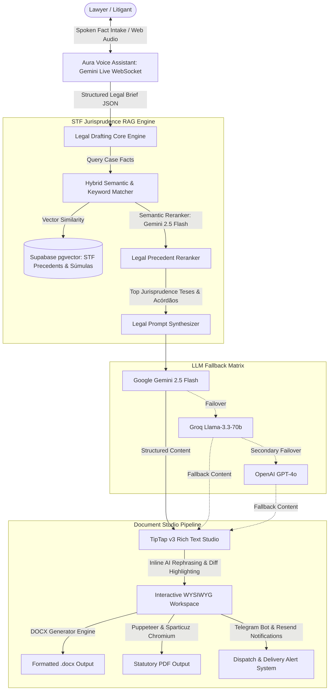

# ⚖️ SmartDoc / Extrajus — AI Legal Tech Suite, STF RAG Vector Engine & Tiptap Document Editor

<p align=center>
  
  
  
  
  
  
  
  
</p>

---

## 📌 Executive Overview

**SmartDoc (Extrajus)** is an enterprise-grade legal engineering platform built for Brazilian attorneys, corporate counsel, and litigants. It bridges real-time multimodal voice intake, high-precision retrieval-augmented generation (RAG) across Brazilian Supreme Court (STF) jurisprudence and statutory precedents, and an extensible WYSIWYG legal editor powered by TipTap v3 and ProseMirror.

From conversational fact gathering via **Aura** (a Gemini Live voice legal triage assistant) to automated RAG citation matching, surgical inline diff revisions, automated instant Pix monetization, and lossless .docx/.pdf generation, SmartDoc transforms statutory notice drafting and civil petitions into an automated workflow.

---

## 🏗️ System Architecture



---

## ✨ Key Features & Legal Capabilities

- 🎙️ **Aura — Real-Time Conversational Legal Triage:** Full-duplex voice intake utilizing Gemini Live WebSockets to capture dispute narratives, identify responsible parties, and calculate financial damages.
- 📚 **Deep STF Jurisprudence RAG Knowledge Base:** Over 20 specialized legal domain repositories covering Constitutional control, Súmulas Vinculantes, STF Informatives (from initial volumes to 2025/2026), criminal procedure, and tax precedent.
- 🎯 **Two-Stage Intelligent Semantic Reranker:** Evaluates retrieved legal arguments against the specific case facts using Gemini 2.5 Flash with custom procedural temperature parameters.
- ✍️ **Custom TipTap v3 Editorial Studio:** Full rich-text legal drafting environment featuring floating toolbars, typography controls, blockquotes, automated legal numbering, and inline diff highlight tracking.
- ⚡ **Multi-LLM Zero-Downtime Cascade:** Fault-tolerant drafting pipeline integrating Gemini 2.5 Flash, Groq Llama 3.3, and OpenAI.
- 📑 **Lossless Legal Document Publishing:** Direct server-side compilation to standardized judicial .docx files via docx / html-to-docx, complete with standardized ABNT margins, formal legal headings, and signature blocks.
- 💳 **Integrated Instant Pix Monetization:** Built-in dynamic Pix QR-code generation, automatic transaction verification polling, and delivery unlocks.

---

## 🛠️ Technology Stack

| Layer | Technologies |
|---|---|
| **Framework & UI** | Next.js 16.3.2 (App Router), React 19.2.4, Radix UI, Tailwind CSS v4, SCSS |
| **Rich Text Editor** | TipTap v3 Suite (@tiptap/core, @tiptap/pm, @tiptap/react), ProseMirror |
| **AI Inference & RAG** | Google Gemini Live, @google/generative-ai (Gemini 2.5 Flash), Groq SDK, OpenAI SDK |
| **Vector Database & Backend** | Supabase (@supabase/supabase-js, @supabase/ssr), PostgreSQL pgvector |
| **Document Export Engines** | docx 9.7, html-to-docx, Puppeteer Core, @sparticuz/chromium |
| **Messaging & Notifications** | Resend API, Telegram Bot API |
| **Audio Processing** | Web Audio API, PCM 16/24kHz streaming, WebSocket (ws) |

---

## 📂 Project Structure

```
smartdoc/
├── public/                     # Static brand assets and templates
├── src/
│   ├── app/                    # Next.js App Router (editor, checkout, API routes)
│   ├── components/
│   │   ├── tiptap-templates/   # Pre-configured legal petition layouts
│   │   ├── tiptap-ui/          # Custom editorial toolbars, font pickers, and modals
│   │   └── ui/                 # Radix UI and atomic UI primitives
│   ├── hooks/
│   │   ├── use-gemini-live.ts  # Multimodal voice socket client for Aura
│   │   └── use-tiptap-editor.ts# Editor instance and formatting hooks
│   ├── knowledge/              # Curated STF jurisprudence & RAG reranking engine
│   │   ├── index.ts            # Hybrid retriever and Gemini Flash reranker
│   │   ├── stf_sumulas_vinculantes.md
│   │   └── stf_jurisprudencia_*.md
│   ├── lib/
│   │   ├── email.ts            # Resend transaction dispatch
│   │   ├── peticao-template.ts # Standard legal pleading structure
│   │   ├── telegram.ts         # Operations monitoring bot
│   │   └── tiptap-utils.ts     # ProseMirror node and mark helpers
│   └── utils/
│       ├── audio-player.ts     # Low-latency PCM stream player
│       └── docx.ts             # Judicial .docx compiler
├── package.json
└── tsconfig.json
```

---

## 🚀 Getting Started

### Prerequisites

- **Node.js**: v18.18+ or v20+
- **Supabase Account** (with pgvector enabled)
- **Google Gemini API Key**

### 1. Clone the Repository

```bash
git clone https://github.com/felipedutrag/smartdoc.git
cd smartdoc
```

### 2. Configure Environment Variables

Create .env.local:

```env
# AI Models
GEMINI_API_KEY=your_gemini_key
GROQ_API_KEY=your_groq_key
OPENAI_API_KEY=your_openai_key

# Supabase RAG
NEXT_PUBLIC_SUPABASE_URL=your_supabase_url
NEXT_PUBLIC_SUPABASE_ANON_KEY=your_supabase_anon_key
SUPABASE_SERVICE_ROLE_KEY=your_supabase_service_key

# Notifications & Payments
RESEND_API_KEY=your_resend_key
TELEGRAM_BOT_TOKEN=your_telegram_bot_token
TELEGRAM_CHAT_ID=your_telegram_chat_id
```

### 3. Install & Launch

```bash
npm install
npm run dev
```

---

## 👤 Author

**Felipe Dutra**  
- **GitHub:** [@felipedutrag](https://github.com/felipedutrag)  
- **Email:** [felipedutra@outlook.com](mailto:felipedutra@outlook.com)
